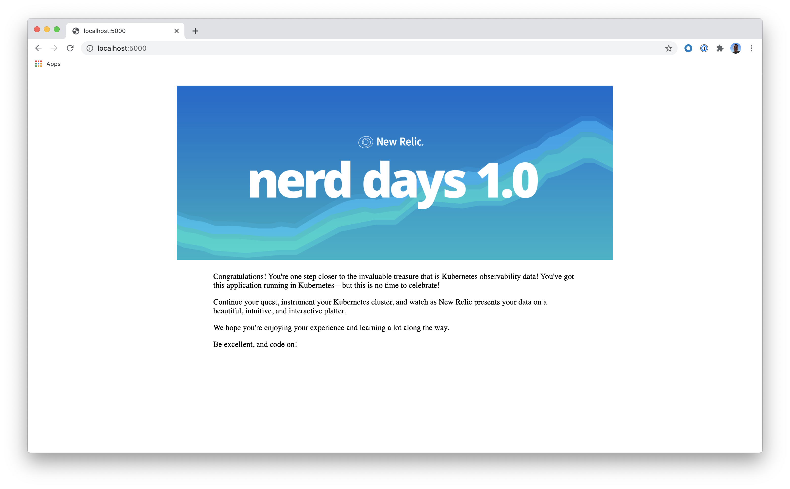

# Integrating New Relic with Kubernetes - Lab 1

Welcome! This lab correlates with the _Integrating New Relic with Kubernetes_ talk from Nerd Days 1.0. It is the first of four hands-on labs you'll walk through in your session.

In this lab, you'll deploy a small Flask app in a local Kubernetes cluster using Minikube.

## Prerequisites

To complete this lab, you need:

- [Docker](https://docs.docker.com/get-docker/)
- [Minikube](https://kubernetes.io/docs/tasks/tools/install-minikube/)

Once you've installed the prerequisite software, you may begin the lab.

## Start Minikube

Minikube allows you to spin up a local, single-node Kubernetes cluster on your local machine.

Start a local Minikube cluster:

```console
$ minikube start --driver=docker
```

> **Note:** If you're using a different hypervisor, use your [driver](https://kubernetes.io/docs/setup/learning-environment/minikube/#specifying-the-vm-driver) instead of `docker`.

## Use Minikube Docker daemon

Instead of using a Docker registry for your image, you can build your Docker images inside Minikube's daemon. This simplifies some of the process of deploying your application.

First, run `minikube docker-env`, which sets some environment variables:

```console
$ minikube docker-env
export DOCKER_TLS_VERIFY="1"
export DOCKER_HOST=<host>
export DOCKER_CERT_PATH=<cert path>
export MINIKUBE_ACTIVE_DOCKERD="minikube"

# To point your shell to minikube's docker-daemon, run:
# eval $(minikube -p minikube docker-env)
```

Second, if you haven't already, execute the last line from the output:

```console
$ eval $(minikube -p minikube docker-env)
```

## Create resources

In this lab, you'll deploy a small web app in Kubernetes. To do so, build the project's Docker image:

```console
$ docker build -t kube-lab .
```

Then, apply the manifests in the `kube-manifests` directory:

```console
$ kubectl create -f kube-manifests
deployment.apps/kube-lab created
service/kube-lab created
```

Finally, check your resources to make sure they exist:

```console
$ kubectl get pods
NAME                       READY   STATUS    RESTARTS   AGE
kube-lab-6b7fb45f6-sdw59   1/1     Running   0          6s

$ kubectl get services
NAME         TYPE           CLUSTER-IP       EXTERNAL-IP   PORT(S)          AGE
kube-lab     LoadBalancer   10.101.103.112   <pending>     5000:31453/TCP   13s
kubernetes   ClusterIP      10.96.0.1        <none>        443/TCP          2m3s
```

## View your application

Notice the `kube-lab` load balancer service's pending `EXTERNAL-IP`. You need to expose the LoadBalancer on localhost, using `minikube tunnel` from a different terminal window:

```console
$ minikube tunnel
🏃  Starting tunnel for service kube-lab.
```

Now, you should see an `EXTERNAL-IP`:

```console
$ kubectl get services
NAME         TYPE           CLUSTER-IP       EXTERNAL-IP   PORT(S)          AGE
kube-lab     LoadBalancer   10.101.103.112   127.0.0.1     5000:31453/TCP   58s
kubernetes   ClusterIP      10.96.0.1        <none>        443/TCP          2m48s
```

Visit the service (at port 5000) in your browser:



## Next Steps

Great work! You've successfully deployed an app in Kubernetes. In the [next lab](../kube-lab-2/README.md), you'll learn how to instrument Kubernetes using our automated installer.