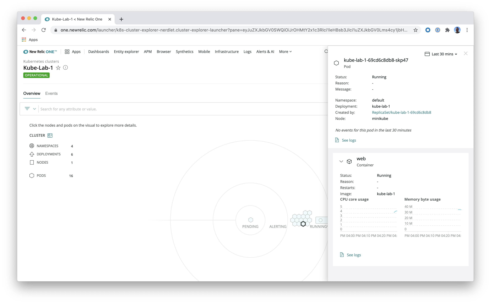

# Integrating New Relic with Kubernetes - Lab 1

Welcome! This lab correlates with the _Integrating New Relic with Kubernetes_ talk from Nerd Days 2020. It is the first of three hands-on labs you'll walk through in your session.

In this lab, you'll:

- Deploy a Flask app in a local Kubernetes cluster
- Integrate New Relic with your cluster **using our automated installer**

Enjoy your session!

## Prerequisites

To complete this lab, you need:

- [Docker](https://docs.docker.com/get-docker/)
- [Minikube](https://kubernetes.io/docs/tasks/tools/install-minikube/)
- [A New Relic account](https://newrelic.com/signup)

Once you've installed the prerequisite software, you may begin the lab.

## Start Minikube

Minikube allows you to spin up a local, single-node Kubernetes cluster on your local machine.

Start a local Minikube cluster:

```console
$ minikube start --driver=docker
```

> **Note:** If you're using a different hypervisor, use your [driver](https://kubernetes.io/docs/setup/learning-environment/minikube/#specifying-the-vm-driver) instead of `docker`.

## Use Minikube Docker daemon

Instead of using a Docker registry for your image, you can build your Docker images inside Minikube's daemon. This simplifies some of the process of deploying your application.

First, run `minikube docker-env`, which sets some environment variables:

```console
$ minikube docker-env
export DOCKER_TLS_VERIFY="1"
export DOCKER_HOST=<host>
export DOCKER_CERT_PATH=<cert path>
export MINIKUBE_ACTIVE_DOCKERD="minikube"

# To point your shell to minikube's docker-daemon, run:
# eval $(minikube -p minikube docker-env)
```

Second, if you haven't already, execute the last line from the output:

```console
$ eval $(minikube -p minikube docker-env)
```

## Create resources

In this lab, you'll deploy a small web app in Kubernetes. To do so, build the project's Docker image:

```console
$ docker build -t kube-lab-1 .
```

Then, apply the manifests in the `kube-manifests` directory:

```console
$ kubectl create -f kube-manifests
deployment.apps/kube-lab-1 created
service/kube-lab-1 created
```

Finally, check your resources to make sure they exist:

```console
$ kubectl get pods
NAME                          READY   STATUS    RESTARTS   AGE
kube-lab-1-69cd6c8db8-xvl6h   1/1     Running   0          14m

$ kubectl get services
NAME         TYPE           CLUSTER-IP     EXTERNAL-IP   PORT(S)          AGE
kube-lab-1   LoadBalancer   10.99.10.112   <pending>     5000:30300/TCP   2m58s
kubernetes   ClusterIP      10.96.0.1      <none>        443/TCP          3h32m
```

## View your application

Notice the `kube-lab-1` load balancer service's pending `EXTERNAL-IP`. You need to expose the LoadBalancer on localhost, using `minikube tunnel` from a different terminal window:

```console
$ minikube tunnel
🏃  Starting tunnel for service kube-lab-1.
```

Now, you should see an `EXTERNAL-IP`:

```console
$ kubectl get services
NAME         TYPE           CLUSTER-IP     EXTERNAL-IP   PORT(S)          AGE
kube-lab-1   LoadBalancer   10.99.10.112   127.0.0.1     5000:30300/TCP   15m
kubernetes   ClusterIP      10.96.0.1      <none>        443/TCP          3h44m
```

Visit the service (at port 5000) in your browser:


## Instrument your service

Great! Now you're running an application in Kubernetes. Next, you'll instrument it with New Relic using the [automated installer](https://one.newrelic.com/launcher/nr1-core.settings?pane=eyJuZXJkbGV0SWQiOiJrOHMtY2x1c3Rlci1leHBsb3Jlci1uZXJkbGV0Lms4cy1zZXR1cCJ9).

The automated installer is a web interface that does a lot of the work of configuring your environment for you. In labs 2 and 3, you'll learn different ways to configure your environment without the installer, in case it doesn't provide what you need.

First, log in to New Relic and navigate to the [automated installer](https://one.newrelic.com/launcher/nr1-core.settings?pane=eyJuZXJkbGV0SWQiOiJrOHMtY2x1c3Rlci1leHBsb3Jlci1uZXJkbGV0Lms4cy1zZXR1cCJ9).

Second, enter `Kube-Lab-1` for your _CLUSTER NAME_.

You can leave everything else as-is, ensuring _Kubernetes manifest file_ is the install method. Download the manifest file.

Apply the manifest changes:

```console
$ kubectl apply -f <PATH_TO_DOWNLOADED_FILE>
```

Finally, wait a few minutes and navigate to the [Kubernetes Explorer](https://docs.newrelic.com/docs/integrations/kubernetes-integration/understand-use-data/kubernetes-cluster-explorer):

1. [Log in](https://one.newrelic.com/)
2. Select _Infrastructure_ from the top navigation
3. Select _NR1 Kubernetes cluster explorer_ on the right side of the screen


Select the _Kube-Lab-1_ cluster:



> **Don't panic!** If you see a message about incomplete data for the cluster, refresh in a few minutes.

## Tear down

You can remove all your resources from this lab by spinning down Minikube:

```console
$ minikube stop
$ minikube delete
```

## Next Steps

Congratulations! You've successfully deployed and instrumented an app in Kubernetes using the automated installer. To learn how to instrument Kubernetes manually, move on to [lab 2](../kube-lab-2/README.md).