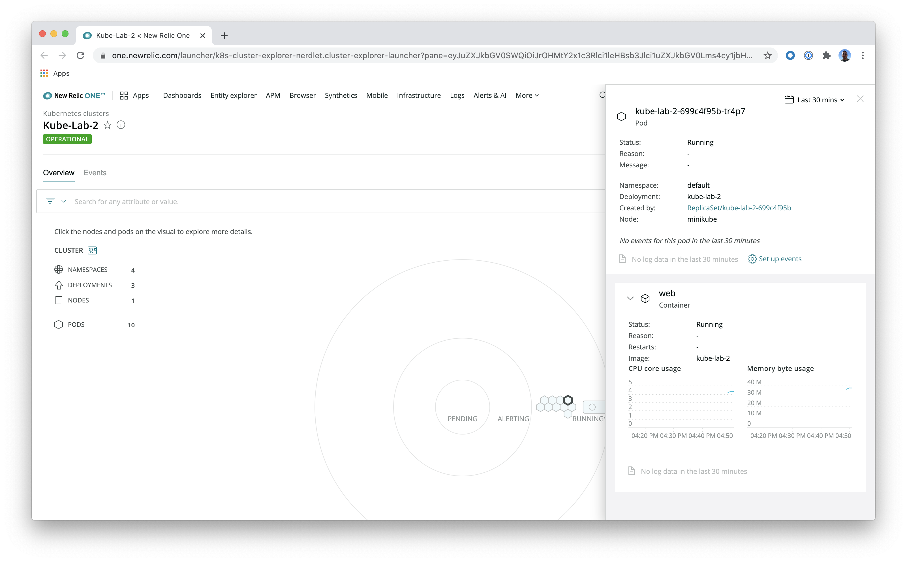

# Integrating New Relic with Kubernetes - Lab 2

Welcome! This lab correlates with the _Integrating New Relic with Kubernetes_ talk from Nerd Days 2020. It is the second of four hands-on labs you'll walk through in your session.

## Prerequisites

To complete this lab, you need:

- The local Kubernetes cluster you created in [lab 1](../kube-lab-1/README.md)
- [A New Relic account](https://newrelic.com/signup)

Once you have the necessary prerequisites, you may begin the lab.

## Instrument your service

In this lab, you'll instrument your Kubernetes cluster with New Relic using the [automated installer](https://one.newrelic.com/launcher/nr1-core.settings?pane=eyJuZXJkbGV0SWQiOiJrOHMtY2x1c3Rlci1leHBsb3Jlci1uZXJkbGV0Lms4cy1zZXR1cCJ9).

The automated installer is a web interface that does a lot of the work of configuring your environment for you. In labs 3 and 4, you'll learn different ways to configure your environment without the installer, in case it doesn't provide what you need.

First, log into New Relic and navigate to the [automated installer](https://one.newrelic.com/launcher/nr1-core.settings?pane=eyJuZXJkbGV0SWQiOiJrOHMtY2x1c3Rlci1leHBsb3Jlci1uZXJkbGV0Lms4cy1zZXR1cCJ9).

Enter `Kube-Lab-2` for your _CLUSTER NAME_. Select _Kube state metrics_ for setup options. Select _Kubernetes manifest file_ as your install method. Download the manifest file.

> **Note:** In these labs, you'll instrument your cluster with only `kube-state-metrics` for simplicity. Know that there are other services you could use, as well, depending on your actual needs.

Apply the manifest changes:

```console
$ kubectl apply -f <PATH_TO_DOWNLOADED_FILE>
```

Finally, wait a few minutes and navigate to the [Kubernetes Explorer](https://docs.newrelic.com/docs/integrations/kubernetes-integration/understand-use-data/kubernetes-cluster-explorer):

1. [Log in](https://one.newrelic.com/)
2. Select _Infrastructure_ from the top navigation
3. Select _NR1 Kubernetes cluster explorer_ on the right side of the screen


Select the _Kube-Lab-2_ cluster:



> **Don't panic!** If you see a message about incomplete data for the cluster, refresh in a few minutes.

## Tear down

For the next lab, you need to tear down your instrumentation. You can remove all your resources from this lab by running `kubectl delete` on the same manifest you used to create the resources:

```console
$ kubectl delete -f <PATH_TO_DOWNLOADED_FILE>
```

## Next Steps

Congratulations! You've successfully instrumented an app in Kubernetes using the automated installer. To learn how to instrument Kubernetes manually, move on to [lab 3](../kube-lab-3/README.md).